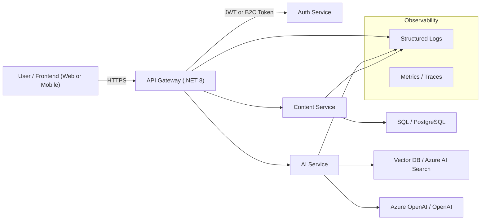

# AI Search Architecture

> AI-enabled knowledge search platform built with **.NET 8 microservices**, **Azure**, and **modern AI (RAG / embeddings)**.  

---

## 🎯 Problem This Solves

Modern teams have documents, SOPs, and knowledge spread across systems.  
This project aims to provide an **AI-powered search service** where a user can:

- Ask questions in **natural language**
- Relevant context is retrieved from indexed documents
- An **AI model (Azure OpenAI / OpenAI)** generates an answer grounded in those documents

---

## 🧱 High-Level Architecture


--- 

## Services (current + planned)

ApiGateway

Single entry point for clients

Routes requests to AuthService, ContentService, AIService

AuthService

Handles authentication (later: Azure AD B2C integration)

Issues and validates JWT tokens

ContentService

CRUD APIs for documents / knowledge items

Persists data in SQL Server / PostgreSQL

Emits events when content changes (future: for re-indexing)

AIService

Embeds text and stores vectors in Vector DB / Azure AI Search

Implements RAG flow: retrieve context → call LLM → return answer


## 🛠️ Tech Stack

Backend / Services:

.NET 8, ASP.NET Core Web API

Minimal APIs

Cloud & Infra (planned):

Azure App Service / Azure Container Apps

Azure Functions (for background indexing)

Azure SQL / PostgreSQL

Azure OpenAI or OpenAI API

Azure AI Search or Qdrant / other Vector DB

DevOps (planned):

Docker for all services

GitHub Actions for CI/CD

Infrastructure-as-Code (Bicep / ARM / Terraform – TBD)


## 🎯 Why This Project Exists

This repository is intentionally structured to:

Demonstrate .NET 8 + Microservices + Azure architecture skills

Showcase AI integration (LLM, embeddings, RAG)

Act as a portfolio project for Senior / Lead / Architect roles

Support discussions in system design / architecture interviews


## 2️⃣ Health Endpoint Code for All Services

In each service’s `Program.cs` (ApiGateway, AuthService, AIService, ContentService), make sure you at least have:

```csharp
var builder = WebApplication.CreateBuilder(args);

builder.Services.AddEndpointsApiExplorer();
builder.Services.AddSwaggerGen();

var app = builder.Build();

if (app.Environment.IsDevelopment())
{
    app.UseSwagger();
    app.UseSwaggerUI();
}

app.MapGet("/health", () => Results.Ok(new { status = "Healthy" }));
app.MapGet("/version", () => Results.Ok(new { 
    service = "ApiGateway",   // change per service
    version = "v1.0.0"
}));

app.Run();

Change "ApiGateway" to "AuthService", "AIService", "ContentService" in each service.


---
## 📄 License